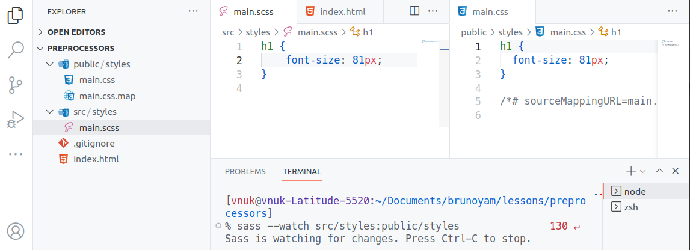

# Пример начала работы с SCSS
Официальная документация

[Install Sass](https://sass-lang.com/install)

Можно использовать приложения для Windows/Mac, можно использовать универсальный вариант с библиотекой

Устанавливаем SASS компилятор как глобальный пакет

```bash
sudo npm i --global saas
```

- Если возникла ошибка, связанная с правами на установку глобального пакета (Linux)

    [https://github.com/tj/n](https://github.com/tj/n)

    ```bash
    sudo npm install -g n
    sudo mkdir -p /usr/local/n
    sudo chown -R $(whoami) /usr/local/n
    sudo mkdir -p /usr/local/bin /usr/local/lib /usr/local/include /usr/local/share
    sudo chown -R $(whoami) /usr/local/bin /usr/local/lib /usr/local/include /usr/local/share
    n lts
    ```


Создаем проект, директории и файл стилей

Должны получить следующую структуру

```bash
.
├── index.html
├── public/
│   └── styles/
└── src/
    └── styles/
        └── main.scss
```

Далее связываем директорию исходных файлов с директорией куда мы в конечном итоге хотим получать стили для браузера командой `sass --watch откуда:куда`

```bash
sass --watch src/styles:public/styles
```



SASS компайлер будет следить (`watch`) за изменением исходных файлов и на лету (после сохранения) подсовывать свежий компилированный файл стилей в понятом для браузера виде

**И подключаем в браузера уже именно его в `index.html`**

```bash
<link rel="stylesheet" href="public/styles/main.css">
```
